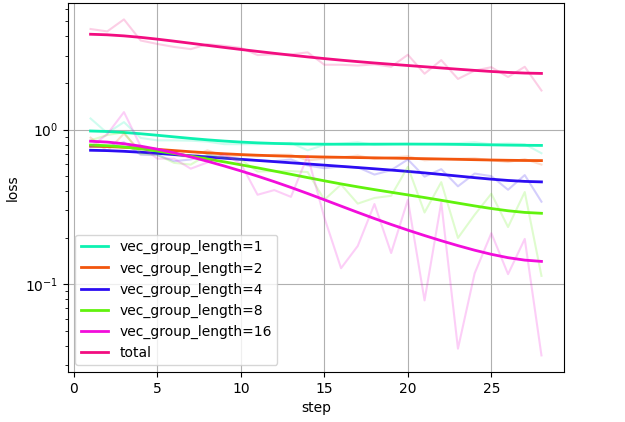
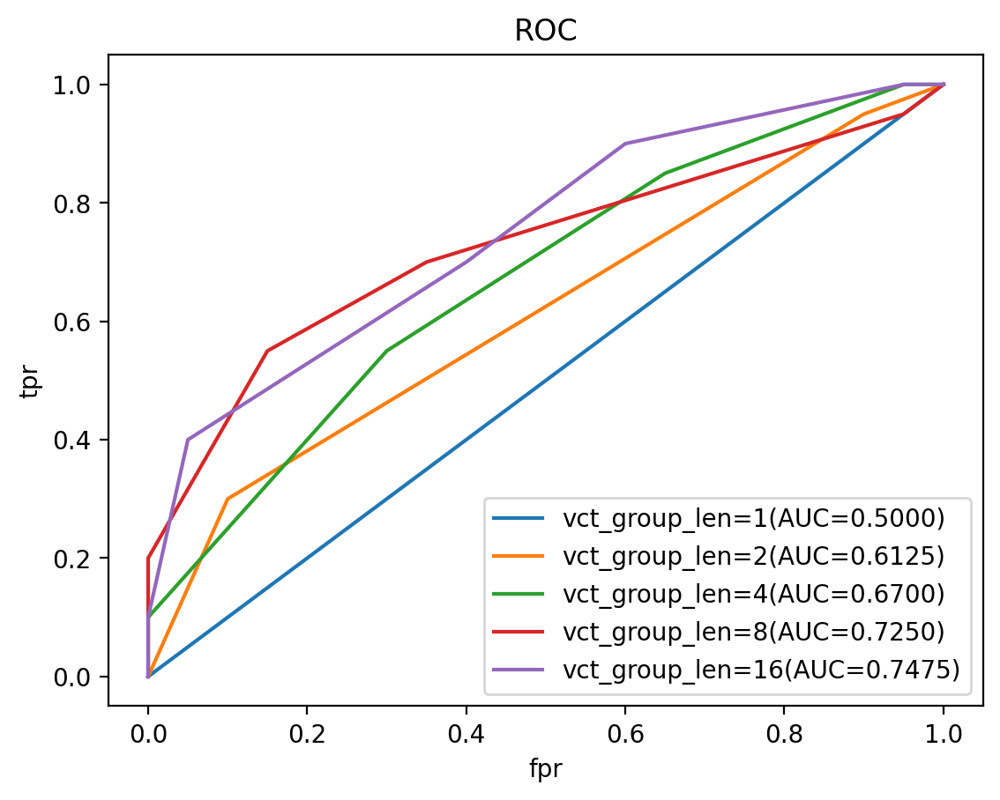

# VLM-soft-tokens-based-reward-hacking-detection
This project aims to train soft tokens and a backbone VLM to detect reward hacking in target VLMs. But this method may be applied to any multi-modal based retrieval scenarios under flexible computation budget.

Highlights:
- Data synthesized from carefully designed pipeline of VLM reinforcement learning based finetuning.
- Solved a few challenging issues brought by the training of soft tokens + LoRA on a larger VLM backbone.
- Experiments done on multiple VLM series under various parameter sizes including Qwen3-VL and LLaVA-OneVision-1.5.
- The following figures are from the training of a Qwen3-VL-8B backbone.

  

    
    
  

- **Setup:**
  1. pip install -r requirements.txt
  2. install [flash attention](https://github.com/Dao-AILab/flash-attention)
- **training:** \
  export HF_TOKEN=<YOUR_HF_TOKEN>;
  python train.py 
  --model-name Qwen/Qwen3-VL-8B-Instruct 
  --dataset josephzhong/mm-geometry-RewardHacking
  --problem-col-name question 
  --attn-implementation flash_attention_2
  --groups-q 1 2 4 8 16 --groups-c 1 2 4 8 16 
  --num-epochs 4 --max-length 12288 
  --batch-size 4 
  --lr 1e-4 --temperature 0.7 
  --lora-r 32 --lora-alpha 64 

- **evaluation:** \
    python eval.py 
  --model-name 
   <BACKBONE_MODEL_NAME> 
  --save-path 
   <THE_MODEL_SAVE_PATH>
  --problem-col-name question 
  --dataset josephzhong/mm-geometry-RewardHacking
  --attn-implementation flash_attention_2 
  --threshold-precision 0.05
  --batch-size 4
  --max-length 12288 
  --temperature 0.7
